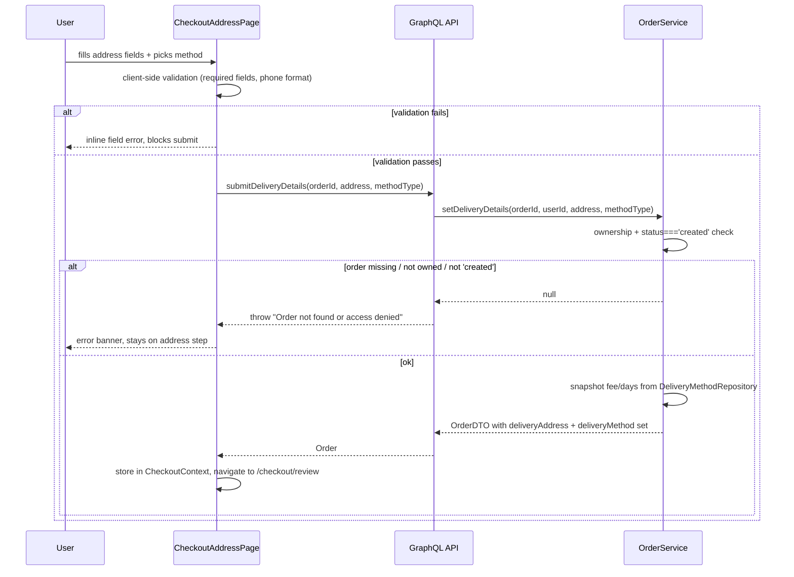
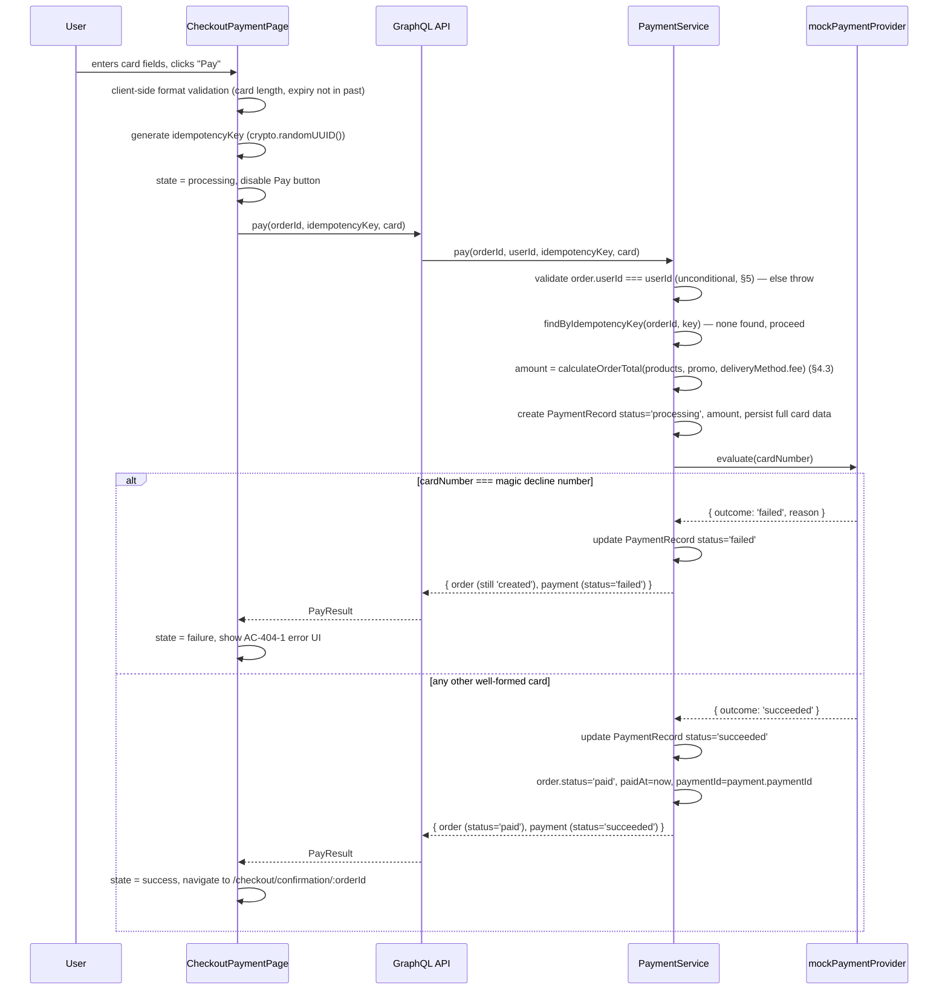
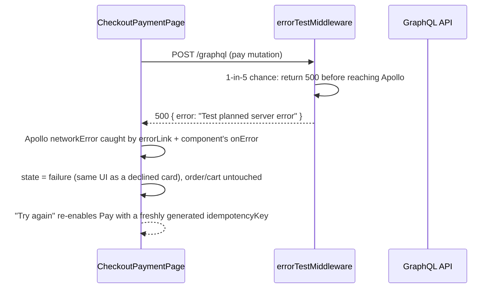
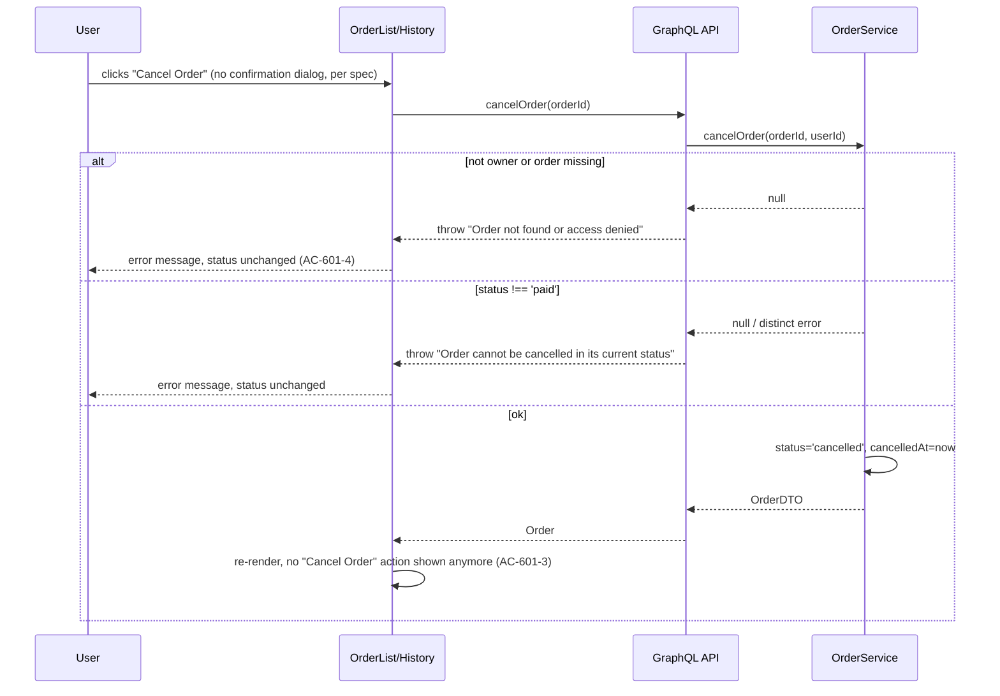

# Checkout Epic — Technical Design Document

**Status**: DRAFT — awaiting design review (Phase 3)
**Parent requirements**: [`00-overview.md`](00-overview.md) and features [`01`](01-auth-gated-checkout.md)–[`06`](06-order-cancellation.md) in this folder
**Author**: Architect (Phase 2, per `ai-workflow` SDLC)

This is **one coherent design covering all six checkout features**. Section 2 fixes the shared data model once; every feature section below builds on that fixed model rather than inventing its own. Planner/plan-reviewer agents splitting work per feature MUST treat section 2 and section 3 as frozen contracts — do not let a per-feature implementation plan redefine `Order.status`, `Payment`, `DeliveryAddress`, or `DeliveryMethod`.

---

## 1. Problem/Scope Recap

Today `OrderService.submitOrder` (`backend/src/services/orderService.ts:119`) is the only "completion" action: it flips `OrderRecord.status` from `created` to `submited` with no address, no delivery choice, and no payment. This epic replaces that dead-end with a real, auth-gated, multi-step checkout (address → review → mock card payment → confirmation) ending in a `paid` order that appears in an enriched order history and can be cancelled. Full problem statement, roles, and DoD: [`00-overview.md`](00-overview.md) §1, §7.

Scope is exactly features 1–6 in the overview. Out-of-scope items (guest checkout, add-to-cart, stock checks, address book, real payment gateway, refunds, notifications, order editing) are **not** re-litigated here — see overview §5.

---

## 2. Shared Data Model

### 2.1 `Order` — extended `OrderRecord` / `OrderDTO`

```ts
// backend/src/types/entities.ts

export type OrderStatus =
  | 'created'    // existing: the cart
  | 'submited'   // existing, LEGACY — see §7 risk 2, no longer reachable from the new checkout UI
  | 'finished'   // existing, LEGACY — pre-existing seed data only (order-1)
  | 'paid'       // NEW — set by a successful payment (feature 4)
  | 'cancelled'; // NEW — set by cancellation (feature 6)

export interface DeliveryAddress {
  recipientName: string;
  phone: string;
  country: string;
  city: string;
  street: string;
  building: string;
  apartment?: string;
  postalCode: string;
}

export type DeliveryMethodType = 'regular' | 'extra';

// Snapshot stored ON the order at the moment the user picks a method —
// NOT a live reference to the catalog, so a later price change (§2.2)
// never retroactively changes an existing order's total.
export interface DeliveryMethodSnapshot {
  type: DeliveryMethodType;
  fee: number;
  estimatedDays: string; // e.g. "3-5" or "1-2", matches AC-202-1 display format
}

export interface OrderRecord {
  orderId: string;
  userId: string;
  status: OrderStatus;
  createAt: number;
  products: Array<{ id: string; amount: number; price: number }>;
  promo?: PromoEntity;

  // NEW fields, all optional because legacy orders (order-1, order-2 seed
  // data) and orders that never reached the delivery step won't have them
  deliveryAddress?: DeliveryAddress;
  deliveryMethod?: DeliveryMethodSnapshot;
  paymentId?: string;   // FK-style pointer to the PaymentRecord that paid this order
  paidAt?: number;
  cancelledAt?: number;
}

export interface OrderDTO {
  orderId: string;
  status: OrderStatus;
  products: Array<{ product: ProductRecord; amount: number; price: number }>;
  promo?: PromoEntity;
  deliveryAddress?: DeliveryAddress;
  deliveryMethod?: DeliveryMethodSnapshot;
  payment?: PaymentSummaryDTO; // projection, see §2.3
  total: number; // NEW — computed in transformToDTO via calculateOrderTotal (§4.3),
                  // not a stored field; subtotal with promo applied + deliveryMethod.fee (0 if no deliveryMethod yet)
}
```

> Assumption: `submited` and `finished` are left in the type union untouched (not removed) because they're pre-existing seed data (`order-1` is `finished`) and removing them is out of scope / would be a breaking type change with no product ask behind it. The new checkout flow simply never produces them. See §7 risk 2 for the UI implication (the existing "Submit Order" button must stop writing `submited`).

### 2.2 `DeliveryMethod` catalog (config, not per-order)

A small fixed catalog, seeded like `InMemoryProductRepository`, so fees are "configurable, not hardcoded in the UI layer" per feature 2's NFR:

```ts
export interface DeliveryMethodOption {
  type: DeliveryMethodType;
  label: string;       // "Regular" | "Extra"
  fee: number;
  estimatedDays: string;
}
```

> Assumption (per Q2.1 in `02-delivery-selection.md`, unresolved): placeholder values — Regular = `$5.99`, "3-5" days; Extra = `$14.99`, "1-2" days. Flagged for product confirmation before copy/design is finalized; the catalog being config-driven (§2.2) means changing these later is a data change, not a code change.

### 2.3 `Payment`

```ts
export type PaymentStatus = 'pending' | 'processing' | 'succeeded' | 'failed';

export interface PaymentRecord {
  paymentId: string;
  orderId: string;
  userId: string;
  idempotencyKey: string;
  method: 'card';
  // Persisted in full, unmasked, by explicit product decision — see §5 and
  // docs/decisions.md. Do NOT mask/truncate these on write.
  cardNumber: string;
  expiry: string;        // as entered, e.g. "09/27" — no MM/YY split, matches spec's data entity list literally
  cvv: string;
  cardholderName: string;
  amount: number;        // NEW — the order total charged, computed server-side via the
                          // §4.3 calculateOrderTotal (subtotal with promo applied + delivery
                          // fee) at the moment this attempt is created, not a client-supplied value
  status: PaymentStatus;
  failureReason?: string;
  createdAt: number;
  updatedAt: number;
}

// Read-model projection returned over GraphQL for order-history display —
// this is the ONLY place any masking happens; storage (above) is never masked.
export interface PaymentSummaryDTO {
  paymentId: string;
  status: PaymentStatus;
  cardLast4: string;
  cardholderName: string;
  failureReason?: string;
  createdAt: number;
}
```

> Assumption: `PaymentSummaryDTO` masks the card down to last-4 for the GraphQL read model used by order history / confirmation screens (features 5). This does **not** contradict the "do not mask on persistence" requirement — the full `PaymentRecord` in `IPaymentRepository` is always stored unmasked; only the outward-facing display projection is reduced. Flagged explicitly because the requirement docs don't say either way for the *display* layer — confirm with security-reviewer/product before implementation if full-card display is actually wanted somewhere.

A `PaymentRecord` is created **per payment attempt**, so failed attempts remain in the repository as an audit trail and a fresh attempt (new `idempotencyKey`) is created on retry (AC-404-4). `Order.paymentId` always points at the attempt currently in effect (the latest `succeeded` one, or the latest attempt overall if none has succeeded yet).

### 2.4 Repository layer — how the existing pattern extends

Existing pattern (`backend/src/repositories/interfaces.ts` + `implementations.ts`): one interface + one `InMemory*` class per entity, private in-memory array, `findById`/`findAll`/etc., and for `Order` a mutating `update()`. Extend it with two **new** repositories, don't touch `IOrderRepository`'s shape (its methods are unchanged — `OrderRecord` just carries more optional fields now):

```ts
// interfaces.ts additions
export interface IDeliveryMethodRepository {
  findAll(): DeliveryMethodOption[];
  findByType(type: DeliveryMethodType): DeliveryMethodOption | undefined;
}

export interface IPaymentRepository {
  findById(paymentId: string): PaymentRecord | undefined;
  findByOrderId(orderId: string): PaymentRecord[];
  findByIdempotencyKey(orderId: string, idempotencyKey: string): PaymentRecord | undefined;
  create(payment: PaymentRecord): void;
  update(payment: PaymentRecord): void;
}
```

`InMemoryDeliveryMethodRepository` seeds the two fixed options from §2.2. `InMemoryPaymentRepository` follows the exact same shape as `InMemoryOrderRepository` (private array + `reset()` for parity with the existing `/reset/orders` test-reset route — add a matching `/reset/payments` or fold payments into the existing reset routes, see §7).

New services, following the existing constructor-injection style (`OrderService(orderRepository, productRepository, promoRepository)`):

- **`OrderService`** (extended, not replaced) gains:
  - `getCurrentCart(userId): Promise<OrderDTO | null>` — returns the user's single `created`-status order or `null` (backs feature 1's AC-102-2/3 and the `CurrentOrder` header fix)
  - `setDeliveryDetails(orderId, userId, address: DeliveryAddress, methodType: DeliveryMethodType): Promise<OrderDTO | null>` — validates ownership + `status === 'created'`, looks up the fee/days snapshot from `IDeliveryMethodRepository`, writes `deliveryAddress` + `deliveryMethod` onto the order
  - `cancelOrder(orderId, userId): Promise<OrderDTO | null>` — validates ownership + `status === 'paid'` (rejects otherwise), sets `status: 'cancelled'`, `cancelledAt`
  - `transformToDTO` extended to also project `deliveryAddress`, `deliveryMethod`, and `payment` (via a new `PaymentService.getSummaryForOrder(orderId)` call)

- **`PaymentService`** (new file, `backend/src/services/paymentService.ts`), constructed with `(paymentRepository, orderRepository)`:
  - `pay(orderId, userId, idempotencyKey, card): Promise<{ order: OrderDTO; payment: PaymentSummaryDTO }>` — full flow in §5
  - `getSummaryForOrder(orderId): PaymentSummaryDTO | undefined`

---

## 3. API/GraphQL Contract

The frontend talks to GraphQL exclusively (`frontend/src/apollo/client.ts`); the REST layer (`orderRoutes.ts`, Swagger) is not used by any browser code today. **New checkout capability is added to GraphQL only.** REST is left as-is functionally (no new REST endpoints for checkout) but see the repository-split fix below, which is required regardless.

### 3.1 Fixing the REST/GraphQL separate-repository bug

`backend/src/app.ts` currently instantiates `InMemoryOrderRepository` (and every other repo) **twice** — once in `initializeRoutes()` (line 51-56) and again in `initializeGraphQL()` (line 101-106) — so a mutation via GraphQL is invisible to REST and vice versa. This is tolerable today only because REST is effectively unused by the app. It stops being tolerable once checkout adds `submitDeliveryDetails`/`pay`/`cancelOrder` GraphQL mutations that write address/payment/status data that Swagger/REST consumers (or future REST-based tests) would read from a stale, permanently-empty-of-checkout-data copy.

**Fix required as part of this epic**: construct each repository exactly once in the `App` constructor, store as instance fields, and pass the same instances into both `initializeRoutes()` and `initializeGraphQL()`. This is a small, mechanical refactor of `app.ts` (no interface changes) — flagged for the planner as a small, high-priority prerequisite task, not a "nice to have."

> Assumption: this fix is in scope because the bug directly affects data integrity for the new checkout fields, even though no requirement doc mentions it explicitly. Flagged for plan-reviewer to confirm it's acceptable to touch `app.ts` under this epic rather than as a separate hotfix.

### 3.2 Schema additions (`backend/src/graphql/schema.ts`)

```graphql
enum OrderStatus {
  created
  submited
  finished
  paid
  cancelled
}

enum DeliveryMethodType {
  regular
  extra
}

enum PaymentStatus {
  pending
  processing
  succeeded
  failed
}

type DeliveryAddress {
  recipientName: String!
  phone: String!
  country: String!
  city: String!
  street: String!
  building: String!
  apartment: String
  postalCode: String!
}

type DeliveryMethodOption {
  type: DeliveryMethodType!
  label: String!
  fee: Float!
  estimatedDays: String!
}

type DeliveryMethodSnapshot {
  type: DeliveryMethodType!
  fee: Float!
  estimatedDays: String!
}

type PaymentSummary {
  paymentId: ID!
  status: PaymentStatus!
  cardLast4: String!
  cardholderName: String!
  failureReason: String
  createdAt: Float!
}

type Order {
  orderId: ID!
  status: OrderStatus!
  products: [OrderItem!]!
  promo: Promo
  deliveryAddress: DeliveryAddress
  deliveryMethod: DeliveryMethodSnapshot
  payment: PaymentSummary
  total: Float!  # NEW — server-computed via calculateOrderTotal (§4.3): subtotal with
                 # promo discount applied (calculateOrderSum) + deliveryMethod.fee.
                 # Not a stored field; resolved on the fly in transformToDTO.
}

input DeliveryAddressInput {
  recipientName: String!
  phone: String!
  country: String!
  city: String!
  street: String!
  building: String!
  apartment: String
  postalCode: String!
}

input CardInput {
  cardNumber: String!
  expiry: String!
  cvv: String!
  cardholderName: String!
}

type PayResult {
  order: Order!
  payment: PaymentSummary!
}

extend type Query {
  currentCart: Order
  deliveryMethods: [DeliveryMethodOption!]!
}

extend type Mutation {
  submitDeliveryDetails(orderId: ID!, address: DeliveryAddressInput!, deliveryMethodType: DeliveryMethodType!): Order!
  pay(orderId: ID!, idempotencyKey: String!, card: CardInput!): PayResult!
  cancelOrder(orderId: ID!): Order!
}
```

(`Order`, `Query`, `Mutation` are shown as the merged result — implementation-wise just edit the existing `type Order`/`Query`/`Mutation` blocks in `schema.ts` in place, following the existing single-file convention; no need for actual `extend` syntax.)

### 3.3 Resolvers (`backend/src/graphql/resolvers.ts`)

All new resolvers follow the exact existing auth pattern: `extractUserIdFromToken(context)` → 401-equivalent `throw new Error('Authentication required')` if missing → call into the service. No new auth mechanism.

**Deviation from the legacy resolver pattern, required for this epic:** the existing resolvers in `backend/src/graphql/resolvers.ts` wrap their service call in a try/catch that discards the real error and rethrows a generic, hardcoded message (e.g. `'Failed to fetch order'`), regardless of what actually failed. If the three new checkout resolvers (`submitDeliveryDetails`, `pay`, `cancelOrder`) copied that pattern verbatim, the distinct, meaningful error strings this design specifies below (`'Order not found or access denied'` vs. `'Order cannot be cancelled in its current status'`, etc.) would never reach the client — they'd all be flattened into one generic message inside the catch block, which breaks AC-601-4 and the address/payment error-banner UX in §4.1–§4.4 that depend on distinguishing these cases. **For these three new resolvers specifically**, the catch block (if present at all) must rethrow the original `Error`'s message unchanged — `catch (e) { throw e; }` or simply omit the try/catch and let the error propagate — rather than swallowing it into a generic string. This is a deliberate, scoped deviation from the legacy convention; it does not require touching the existing resolvers for `order`/`orders`/etc.

| Resolver | Auth | Behavior |
|---|---|---|
| `Query.currentCart` | required | `orderService.getCurrentCart(userId)`, returns `null` if none — frontend distinguishes "no cart" from a GraphQL error |
| `Query.deliveryMethods` | required (consistent with rest of API; no public queries exist today) | returns the 2-item catalog from `IDeliveryMethodRepository` |
| `Mutation.submitDeliveryDetails` | required | ownership + `status === 'created'` check inside `OrderService`; throws `'Order not found or access denied'` (matches existing wording) or a validation error if address fields fail server-side checks |
| `Mutation.pay` | required | see §5 for full flow; throws on ownership/status violations, returns `PayResult` (never throws for a *declined* card — that's a normal `PayResult` with `payment.status === 'failed'`, not a GraphQL error, so the frontend can render AC-404-1's failure UI instead of an error boundary) |
| `Mutation.cancelOrder` | required | ownership + `status === 'paid'` check; throws if the order isn't in a cancellable state (AC-601 doesn't specify wording for that error — reuse `'Order not found or access denied'` for ownership misses, add a distinct `'Order cannot be cancelled in its current status'` for a wrong-status attempt) |

Distinguishing "declined card" (business outcome, not an error) from "backend/network failure" (real GraphQL error, e.g. the chaos `errorTestMiddleware` 500) is the key contract decision here: **`pay` never throws for a merchant decline.** This lets the frontend payment state machine (§6) treat "GraphQL error" and "payment.status === 'failed' in a successful response" as two distinct failure sub-states that both render the same failure UI (AC-404-5 requires the chaos 500 to use "the same failure UI as AC-404-1").

---

## 4. Per-Feature Design

### 4.1 Feature 1 — Auth-gated checkout

**Files:**
- New `frontend/src/components/PrivateRoute.tsx` — wraps `<Route>`, checks `localStorage.getItem('auth_token')`, redirects to `/login` with `history.push({ pathname: '/login', state: { from: location.pathname } })` if absent
- `frontend/src/pages/LoginPage.tsx` — on `onCompleted`, change `history.push('/')` to `history.push(location.state?.from ?? '/')` (reads the `from` state pushed above)
- `frontend/src/App.tsx` — wrap all `/checkout/*` routes in `PrivateRoute` (nested structure, §6.1)
- `frontend/src/apollo/client.ts` — its `errorLink` currently only `console.log`s GraphQL/network errors; extend it (or add a component-level handler) to also catch `'Authentication required'` on **query** errors, not just mutations (see edge case below)
- New GraphQL query `currentCart` (§3.2) used to implement AC-102-2/3 (empty-cart message) before rendering the address step

**Step list:**
1. User clicks "Checkout" (feature 1's new entry point, replacing the old "Submit Order" button — see §7 risk 2) on `OrderListItem`/`OrderList`
2. `PrivateRoute` checks `auth_token`; if missing, redirect to `/login` carrying `from: '/checkout/address'`
3. `/checkout/address` page fires `currentCart` query; if `null` or `products.length === 0`, render the empty-cart message (AC-102-2/3) instead of the form
4. Otherwise render the delivery form (feature 2) pre-populated from the cart

**Edge cases:**
- Expired JWT mid-checkout (AC-101-3): any checkout **mutation or query** that throws `'Authentication required'` is caught by a shared error handler that clears `auth_token` and redirects to `/login`. This must cover query errors too, not just mutations — e.g. `currentCart` failing with `'Authentication required'` on page load (before a checkout page even renders, if the token expired between page navigations) needs the same redirect treatment as a failed `submitDeliveryDetails`/`pay`/`cancelOrder` call. Implemented in `frontend/src/apollo/client.ts`'s `errorLink` (extended from its current console-log-only behavior) so both query and mutation errors are handled in one place, rather than duplicating the check per-page. The order itself is untouched server-side so nothing is lost (the cart is still `created` in the backend regardless of frontend auth state)
- User has zero `created` orders at all vs. an empty-products `created` order: both render the same message per AC-102-3, driven off `currentCart` returning `null` vs. returning an order with `products: []`

### 4.2 Feature 2 — Delivery address & method selection

**Files:**
- Backend: `IDeliveryMethodRepository`/`InMemoryDeliveryMethodRepository` (§2.4), `OrderService.setDeliveryDetails`
- Frontend: `frontend/src/pages/checkout/CheckoutAddressPage.tsx`, `frontend/src/components/checkout/DeliveryAddressForm.tsx`, `frontend/src/components/checkout/DeliveryMethodPicker.tsx`
- `frontend/src/graphql/queries.ts` — add `GET_DELIVERY_METHODS`, `GET_CURRENT_CART`
- `frontend/src/graphql/mutations.ts` — add `SUBMIT_DELIVERY_DETAILS`



**Edge cases:**
- Back-navigation preserving values (AC-201-5): handled entirely client-side by `CheckoutContext` (§6), not by re-fetching — the order's `deliveryAddress`/`deliveryMethod` are already persisted server-side after step 2 completes, so even a hard refresh at the review step could re-hydrate from `currentCart` if desired (see §7 risk 5 for the gap that remains)
- Neither method selected (AC-202-2): `DeliveryMethodPicker` has no default selection; submit button `disabled` until one is chosen — no server round-trip needed to enforce this, `deliveryMethodType` is a required GraphQL argument so an empty submission is impossible by construction

### 4.3 Feature 3 — Order review

**Files:**
- Backend: `OrderService.calculateOrderSum` (`backend/src/services/orderService.ts:30-54`) extended into a `calculateOrderTotal` helper that also adds the delivery fee (see below); `OrderDTO`/GraphQL `Order` type gains a `total` field (§2.1, §3.2) resolved via this helper in `transformToDTO`
- `frontend/src/pages/checkout/CheckoutReviewPage.tsx`
- `frontend/src/components/checkout/OrderReviewSummary.tsx` (new component; reuses `OrderSum`'s currency formatting convention rather than the component itself, since `OrderSum` is tied to the `GET_ORDER_SUM` query which doesn't know about delivery fees)

**Total is computed server-side — required, not a client formula.** The original draft computed `total = subtotal + deliveryMethod.fee` entirely client-side, bypassing `OrderService.calculateOrderSum` (`backend/src/services/orderService.ts:30-54`), which applies the order's promo discount (`OrderRecord.promo`) when set. Since `promo` is a real field on `OrderRecord` in the shared data model (§2.1), any checkout order carrying a promo would show a wrong review total under the client-only formula (discount silently ignored). **Fix**: extend `calculateOrderSum` (or add a thin wrapper) to also add the delivery fee, e.g. `calculateOrderTotal(products, promoId, deliveryFee) = calculateOrderSum(products, promoId) + deliveryFee`, and expose the result to the frontend as the new `Order.total` field (§2.1, §3.2), resolved server-side in `transformToDTO` — not a new stored field, not client arithmetic. `CheckoutReviewPage` renders `currentCart.total` directly rather than computing it itself — single source of truth.

**Step list:**
1. Page loads, queries `currentCart` (now carrying `deliveryAddress`/`deliveryMethod` from feature 2, and the server-computed total described above)
2. Renders line items, address, method, and the server-computed `total` (subtotal with promo discount applied, plus `deliveryMethod.fee`) — no client-side total arithmetic
3. "Confirm and Pay" navigates to `/checkout/payment` — no mutation fires here; review is read-only per AC-301, all state was already committed to the order in feature 2

**Edge cases:**
- If `currentCart` unexpectedly returns an order without `deliveryAddress`/`deliveryMethod` (e.g., user deep-links to `/checkout/review` directly, or the chaos 500 hit mid-feature-2 in a way that left the order un-updated), redirect back to `/checkout/address` rather than rendering a broken summary

### 4.4 Feature 4 — Online card payment (mocked)

Covered in depth in §5 (mock provider) and §6 (frontend state machine). Files:
- Backend: `backend/src/services/paymentService.ts`, `backend/src/services/mockPaymentProvider.ts` (pure function, no I/O — kept separate from `PaymentService` so the deterministic rule is independently unit-testable)
- Frontend: `frontend/src/pages/checkout/CheckoutPaymentPage.tsx`, `frontend/src/components/checkout/PaymentForm.tsx`, `frontend/src/hooks/usePaymentAttempt.ts` (state machine hook)



Chaos-middleware error path (AC-404-5):



**Server-side format validation**: `PaymentService.pay` adds a brief sanity check on `card.cardNumber`/`card.cvv`/`card.expiry` (digits-only after stripping spaces, plausible length — e.g. 13-19 digits for `cardNumber`, 3-4 digits for `cvv`, `MM/YY`-shaped `expiry`) before calling `evaluateMockPayment`, throwing a validation error otherwise. This is a minimal backstop, not full card validation — its only purpose is to stop a direct GraphQL Playground call from feeding garbage straight into the mock provider / persisted `PaymentRecord`, since client-side validation (below) is bypassable the same way the §4.6 quantity-guard gap was.

**Edge cases (from `04-online-payment.md`):**
- AC-401-2/3: card number / expiry format validated client-side before any network call — no wasted request, no partial `PaymentRecord` created for pure format errors
- AC-402-2: Pay button `disabled` for the entire `processing` state, preventing a second concurrent click from generating a second idempotency key
- AC-404-2/404-3: because `setDeliveryDetails` already persisted address/method onto the order in feature 2, a failed payment leaves the order's `deliveryAddress`/`deliveryMethod`/`products`/`status` completely untouched — only a new `failed` `PaymentRecord` exists
- AC-404-4: unlimited retries; each explicit "Pay" click after a failure is a **new** attempt with a **new** `idempotencyKey` (this is intentional non-idempotency across explicit retries — idempotency only protects a *single* attempt from being double-processed, see §5)
- Deep-link/back-navigation to `/checkout/payment` for an order already `paid` (e.g. user hits back after confirmation, or opens a stale bookmark): without a guard this would render the payment form fresh and a subsequent submit would misleadingly appear to "fail" (the order is no longer `'created'`, so `PaymentService.pay`'s status check throws). **Fix — required**: `CheckoutPaymentPage` checks `currentCart`'s status on mount before rendering `PaymentForm`; if the relevant order is already `status === 'paid'`, redirect immediately to `/checkout/confirmation/:orderId` instead of allowing a Pay submission.

### 4.5 Feature 5 — Order confirmation & history

**Files:**
- `frontend/src/pages/checkout/CheckoutConfirmationPage.tsx` — route `/checkout/confirmation/:orderId`, queries `GET_ORDER(orderId)` (extended, §3.2) for items/address/method/total/payment status
- `frontend/src/components/CurrentOrder.tsx` — **rewritten**, see §6.4
- `frontend/src/components/OrderList.tsx` / `OrderListItem.tsx` — extended to render a new "order detail" block (delivery address, delivery method + fee, payment status badge) and to visually separate `created` (still "your cart") from `paid`/`cancelled` (order history), per AC-503-2
- `frontend/src/graphql/queries.ts` — `GET_ORDERS`/`GET_ORDER` extended to select `deliveryAddress { ... } deliveryMethod { ... } payment { ... }`

**Edge cases:**
- AC-503-3 (most-recent-first): sort client-side by `createAt` descending in `OrderList`, since `IOrderRepository.findByUserId` returns insertion order today with no sort guarantee
- A `created`-status cart coexisting with paid orders (AC-503-2, e.g. abandoned-then-new-cart — not reachable given no add-to-cart, but the UI must not crash if it happens): render it with a distinct "Cart" label rather than a payment-status badge

### 4.6 Feature 6 — Order cancellation

**Files:**
- Backend: `OrderService.cancelOrder` (§2.4), `Mutation.cancelOrder` resolver
- Backend: **mandatory** hardening of `OrderService.deleteProductFromOrder` and `OrderService.updateProductAmount` (`backend/src/services/orderService.ts:56-117`) — see guard requirement below
- Frontend: split into `OrderListItem.tsx` (cart-editing, `status === 'created'` only) and a new `OrderHistoryItem.tsx` (read-only order history for `paid`/`cancelled`) — **required task, not optional.** `OrderHistoryItem.tsx` never renders quantity +/− or delete controls; it renders the delivery/payment detail block and, when `status === 'paid'`, the "Cancel Order" button.

**Backend guard — required, not just a UI recommendation:** today `deleteProductFromOrder` and `updateProductAmount` (`backend/src/services/orderService.ts:56-117`) check only `order.userId === userId` before mutating `order.products` — there is no `order.status` check. Since GraphQL Playground is enabled, any authenticated user can call these mutations directly on their own `paid` or `cancelled` order and edit its line items post-payment, contradicting the explicit "no order editing after payment" requirement. Hiding the +/− and delete controls in the UI (previous paragraph) is necessary but not sufficient — it only stops the *normal* UI path, not a direct GraphQL call. **Both methods MUST add a mandatory guard as their first check after ownership**: if `order.status !== 'created'`, throw an error (e.g. `'Order cannot be modified in its current status'`) instead of proceeding. This applies regardless of which resolver/route calls them (GraphQL and the legacy REST layer both funnel through these two `OrderService` methods).



**Edge cases:**
- AC-601-3: button visibility is a pure function of `status === 'paid'`; once `status === 'cancelled'`, the button disappears with no additional client state needed
- No refund modeling exists (out of scope) — cancelling only changes `Order.status`; the underlying `PaymentRecord.status` stays `succeeded` (it's a historical fact that the payment succeeded; cancellation is a separate, order-level event) — this is a deliberate design point worth a `docs/decisions.md` entry (§7)

---

## 5. Mock Payment Provider Design

**Location**: `backend/src/services/mockPaymentProvider.ts`, a pure function with no repository/DB dependency, called only from `PaymentService.pay`:

```ts
export interface MockPaymentOutcome {
  outcome: 'succeeded' | 'failed';
  failureReason?: string;
}

const MAGIC_DECLINE_CARD_NUMBER = '4000000000000002'; // convention borrowed from
  // real providers' test-card numbering (e.g. Stripe's declined-card test number)

export function evaluateMockPayment(cardNumber: string): MockPaymentOutcome {
  const normalized = cardNumber.replace(/\s+/g, '');
  if (normalized === MAGIC_DECLINE_CARD_NUMBER) {
    return { outcome: 'failed', failureReason: 'Card declined by issuer (mock)' };
  }
  return { outcome: 'succeeded' };
}
```

This directly answers overview Q1 / feature-4 Q4.1: **deterministic by card number**, not random — a specific test card always fails, everything else that passes format validation always succeeds. This is independent of the `errorTestMiddleware` chaos (which can still 500 the whole request before this function ever runs) and independent of the `delayMiddleware` 1500ms delay (which is real network latency the frontend must show a spinner through, per AC-402-3, but doesn't affect the outcome).

> Assumption: no config flag / env var to toggle the rule — the magic card number is hardcoded in this file. This is deliberately simple for a mocked provider; revisit only if a demo needs a second failure mode (e.g., distinguishing "declined" from "insufficient funds" with two different magic numbers) — the `failureReason` field already supports that without a schema change.

### Idempotency (`PaymentService.pay`)

```
0. order = orderRepository.findById(orderId); if missing or order.userId !== userId: throw
     (unconditional — runs BEFORE the idempotency-key lookup below, so both the
     fresh-attempt branch and the replay branch are ownership-checked)
1. lookup = paymentRepository.findByIdempotencyKey(orderId, idempotencyKey)
2. if lookup exists:
     return { order: current order, payment: summary(lookup) }   // no new charge, no duplicate order state change
3. else:
     validate status === 'created' (else throw)
     amount = calculateOrderTotal(order.products, order.promo, order.deliveryMethod.fee)  // §4.3, server-side, single source of truth
     create PaymentRecord (status='processing', amount) and persist immediately
     result = evaluateMockPayment(card.cardNumber)
     update PaymentRecord to 'succeeded' | 'failed' accordingly
     if succeeded: update order -> status='paid', paymentId, paidAt
     return { order, payment: summary(new record) }
```

**Ownership check placement is intentional and mandatory**: step 0 runs unconditionally as the very first thing `PaymentService.pay` does, before branching on the idempotency-key lookup. Previously only the fresh-attempt branch (step 3) validated `order.userId === userId`; the replay branch (step 2) returned the order/payment for an existing `PaymentRecord` match with no ownership check at all. Because `findByIdempotencyKey` only keys on `(orderId, idempotencyKey)` — not `userId` — a client that guessed or observed another user's `idempotencyKey` for a given `orderId` could hit the replay branch and read that order/payment back without ever being ownership-checked. Moving the check to step 0 closes this for both branches uniformly.

Because step 3's create-then-evaluate-then-update happens synchronously within one request handler (the mock provider is not actually async I/O), there is no real window for a *true* double-charge from a single request — the idempotency key's practical value here is guarding against:
- Accidental duplicate submission if the frontend's button-disable logic has a bug or a double-render (React) fires the mutation twice with the same generated key before state updates propagate
- A future change to make the mock provider actually async (e.g., to demonstrate a "processing" state that outlives one request) without silently reintroducing a double-charge bug

Each **explicit** retry after a shown failure (AC-404-4) intentionally uses a **fresh** `idempotencyKey` — that's a new attempt, not a replay, and is expected to create a new `PaymentRecord`.

---

## 6. Frontend Architecture

### 6.1 New routes (React Router v5, `frontend/src/App.tsx`)

```tsx
<Switch>
  <Route exact path="/" component={HomePage} />
  <Route path="/login" component={LoginPage} />
  <Route path="/order" component={OrderPage} />
  <Route path="/checkout">
    <PrivateRoute>
      <CheckoutProvider>
        <Switch>
          <Route exact path="/checkout/address" component={CheckoutAddressPage} />
          <Route exact path="/checkout/review" component={CheckoutReviewPage} />
          <Route exact path="/checkout/payment" component={CheckoutPaymentPage} />
          <Route exact path="/checkout/confirmation/:orderId" component={CheckoutConfirmationPage} />
        </Switch>
      </CheckoutProvider>
    </PrivateRoute>
  </Route>
  <Route path='/hui' component={() => <h1>HUI 888123</h1>}/>
</Switch>
```

A single `<Route path="/checkout">` parent (no `exact`, so it matches all four sub-paths) wraps `PrivateRoute` wraps `CheckoutProvider` wraps a nested `<Switch>` of the four checkout routes. This is required, not a minor variation on the flat list: React Router v5's outer `<Switch>` renders exactly one matching child, so four separate top-level `<PrivateRoute>` entries can never share one `CheckoutProvider` instance the way a flat list implies — each route transition would unmount/remount a fresh provider (or require wrapping the whole `<Switch>`, which would put login/home/order under `CheckoutProvider` too, which is wrong). Nesting the routes as shown is the only way to scope `CheckoutProvider` to exactly the four checkout routes while a single instance persists across navigation between them (§6.2's requirement). `PrivateRoute` here becomes a plain wrapper component (guard-and-render-children) rather than a `<Route component={...}>` prop-injector, since it now wraps a `<Route>` rather than being one itself — update its implementation signature accordingly (§4.1 files list).

### 6.2 Wizard state — `CheckoutContext`

No global state library exists in this app (`frontend/package.json` has no Redux/Zustand/MobX — just Apollo's own cache). Introduce a single `frontend/src/context/CheckoutContext.tsx` using `useReducer`, scoped to a `<CheckoutProvider>` that wraps the nested `<Switch>` of the four checkout routes, itself nested inside `PrivateRoute` under the single `<Route path="/checkout">` parent (§6.1) — one `CheckoutProvider` instance persists across navigation between the four steps, since the nested `<Switch>` only ever swaps its own children, never unmounting the provider around it:

```ts
interface CheckoutState {
  orderId: string | null;
  address: DeliveryAddress | null;
  deliveryMethodType: DeliveryMethodType | null;
  step: 'address' | 'review' | 'payment' | 'confirmation';
}
```

This context is **client-side convenience state only** (pre-filling forms on back-navigation, AC-201-5) — the source of truth for what's actually committed is always the backend order record, fetched via `currentCart`/`GET_ORDER`. This matters because it means a hard page refresh mid-wizard loses only the *in-progress, not-yet-submitted* form values, never anything already confirmed server-side (address/method after feature 2, payment result after feature 4).

> Assumption: in-memory Context (not persisted to `localStorage`/`sessionStorage`) is sufficient — no requirement asks for reload-survival mid-form-entry. Flagged as a risk in §7 in case QA expects it.

### 6.3 Payment state machine — `usePaymentAttempt` hook

Encapsulates the four required states (AC-402/403/404: `entering` → `processing` → `success` | `failure`) so `CheckoutPaymentPage`/`PaymentForm` stay declarative:

```ts
type PaymentAttemptState =
  | { phase: 'entering' }
  | { phase: 'processing' }
  | { phase: 'success'; order: Order }
  | { phase: 'failure'; message: string; retryable: true };
```

The hook owns idempotency-key generation (`crypto.randomUUID()`, available in all evergreen browsers — no new dependency needed), the `pay` mutation call, and normalizes **both** failure sources — a GraphQL/network error (chaos 500) and a normal response with `payment.status === 'failed'` (declined card) — into the same `failure` phase, satisfying AC-404-5's "same failure UI" requirement with one code path instead of two.

### 6.4 Fixing `CurrentOrder`

Current implementation (`frontend/src/components/CurrentOrder.tsx:11-20`) reads/writes a hardcoded `localStorage.getItem('currentItems')` stub (defaults to `10`) that never reflects reality. Replace entirely:

```tsx
const CurrentOrder: React.FC = () => {
  const history = useHistory()
  const { data } = useQuery(GET_CURRENT_CART) // new query, §3.2

  const itemCount = data?.currentCart?.products?.reduce(
    (sum: number, item: { amount: number }) => sum + item.amount, 0
  ) ?? 0

  const handleClick = () => history.push('/order')

  return (
    <Button variant="ghost" size="icon" onClick={handleClick} ...>
      <ShoppingCart className="h-5 w-5" />
      {itemCount > 0 && <Badge ...>{itemCount}</Badge>}
    </Button>
  )
}
```

No more `localStorage` reads/writes for cart state anywhere in the app. After a successful `pay` (feature 4), the order transitions to `paid`, so `currentCart` (which only ever returns a `created`-status order) naturally returns `null` and the badge disappears — this is what "cart is cleared" means in this codebase (there's no literal cart-clearing operation; clearing is a side effect of the order leaving `created` status), satisfying AC-502-1/502-2 without any new mutation.

### 6.5 Existing component changes summary

| File | Change |
|---|---|
| `frontend/src/components/OrderListItem.tsx` | "Submit Order" button (rendered when `status === 'created' && isLast`) replaced with a "Proceed to Checkout" button navigating to `/checkout/address` instead of calling `SUBMIT_ORDER`; retained **only** for `status === 'created'` (quantity +/−, delete, checkout button) |
| `frontend/src/components/OrderHistoryItem.tsx` | **New, required** (§4.6) — read-only rendering for `paid`/`cancelled` orders: delivery/payment detail block, Cancel button when `paid`, no quantity/delete controls |
| `frontend/src/components/OrderList.tsx` | Distinguish `created` (renders `OrderListItem`, cart, editable, quantity controls) from `paid`/`cancelled` (renders `OrderHistoryItem`, read-only, delivery/payment detail block, Cancel button when `paid`) |
| `backend/src/services/orderService.ts` | **Mandatory**: `deleteProductFromOrder` and `updateProductAmount` add a `status === 'created'` guard (throw otherwise) — see §4.6 |
| `frontend/src/components/CurrentOrder.tsx` | Rewritten per §6.4 |
| `frontend/src/pages/LoginPage.tsx` | Redirect-back-to-checkout per §4.1 |
| `frontend/src/App.tsx` | New `PrivateRoute`-wrapped checkout routes + `CheckoutProvider`, nested structure per §6.1 |
| `frontend/src/apollo/client.ts` | `errorLink` extended to handle `'Authentication required'` on both query and mutation errors (clear `auth_token`, redirect to `/login`), not just `console.log` — see §4.1 |
| `frontend/src/graphql/queries.ts` | Add `GET_CURRENT_CART`, `GET_DELIVERY_METHODS`; extend `GET_ORDERS`/`GET_ORDER` field selections |
| `frontend/src/graphql/mutations.ts` | Add `SUBMIT_DELIVERY_DETAILS`, `PAY`, `CANCEL_ORDER` |

---

## 7. Open Technical Questions & Risks

1. **Delivery fee/day placeholders unconfirmed** (Q2.1 in `02-delivery-selection.md`) — Regular `$5.99`/"3-5 days", Extra `$14.99`/"1-2 days" are architect placeholders seeded into `InMemoryDeliveryMethodRepository`. Needs product sign-off before UI copy is finalized; low implementation risk since the catalog is data, not code (§2.2).

2. **Legacy "Submit Order" button/mutation becomes dead code from the UI, not deleted.** `SUBMIT_ORDER`/`submitOrder` resolver and the `submited` status stay in the codebase (§2.1, §6.5) because no requirement doc asks to remove them and doing so isn't strictly necessary for the epic's DoD — but leaving a mutation with no UI caller is a code-smell a reviewer may flag. Plan-reviewer should confirm whether to (a) leave as dead code, (b) delete `submitOrder`/`SUBMIT_ORDER` entirely, or (c) repurpose it for something. This design assumes (a).

3. **REST/GraphQL dual-repository fix is a prerequisite, not a per-feature task** (§3.1). It touches `app.ts`, which no single feature "owns" — the planner should schedule it as an independent, first task before feature 2 (the first feature that writes new state) starts, so every subsequent feature's manual/demo verification via either REST or GraphQL sees consistent data.

4. **Single-`created`-cart-per-user assumption (Q2, overview)** is baked into `getCurrentCart`/`currentCart` (returns one order, not a list). Nothing in the current app can create a second `created` order (no add-to-cart), but the `/reset/orders` test route resets to fixed seed data that already assumes this. If a future test seed or manual DB poke ever produces two `created` orders for one user, `getCurrentCart`'s tie-break behavior is undefined in this design — recommend "most recent by `createAt`" if this is ever implemented, but flagging now so it isn't silently decided during coding.

5. **In-memory-only wizard state (§6.2) does not survive a hard page refresh mid-address-entry.** Values already submitted to the backend (post-feature-2) do survive (re-fetchable via `currentCart`), but a refresh while still typing the address form loses those keystrokes. No AC explicitly requires reload-survival; flagging as a risk in case it's assumed implicitly during manual QA.

6. **`PaymentSummaryDTO` masks the card to last-4 for display (§2.3) — this is an architect judgment call, not a requirement.** The explicit "persist in full, don't mask" instruction is about backend storage; nothing says the read-model must also show the full number back to the user in order history. If a reviewer wants the full card literally re-displayed anywhere in the UI (unlikely, but possible given how unusual the storage requirement already is), that changes `PaymentSummaryDTO` and the corresponding GraphQL type.

7. **`errorTestMiddleware`'s 1-in-5 500 applies uniformly to every checkout mutation**, not just `pay` — `submitDeliveryDetails` and `cancelOrder` can also fail this way. §6.3's unified failure-handling approach is designed for the payment step specifically (AC-404-5 is explicit about it); the same "surfaced as a clear, retryable error, not a crash" treatment must be applied to feature 2's and feature 6's mutations too, even though no AC calls it out by number for those two. Recommend a small shared `useChaosResilientMutation`-style wrapper (or at minimum a consistent error-rendering convention) reused across all three new mutation call sites so this isn't reimplemented three times with three different qualities of error UI.

8. **No time-boxing on cancellation (Q3, overview) is confirmed as designed-in** — `cancelOrder` allows cancellation any time `status === 'paid'`, with no cutoff. Revisit only if a future "shipped" status is introduced.

9. **`docs/decisions.md` must be updated** (DoD item in overview §7) to record at minimum: the deterministic mock-payment rule and magic decline card number (§5), the full-card-persistence deviation from PCI norms and its rationale (§2.3), the single-active-cart assumption (§7.4), and the REST/GraphQL repository-instantiation fix (§3.1) — these are exactly the "non-obvious decisions made during design" the DoD calls for.
